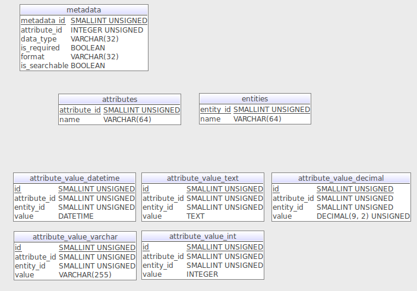

only when data for particular entity is sparse and is vulnerable to change
should consider the this table design pattern
pros:
- flexibility,can add additional attribute on the fly
- can only store non-null attribute's value
cons:
- more complex than traditional table schema
- low efficiency to get bulk data
- more effort to do maintenance work

can reference Magento(PHP) table design to learn more.
