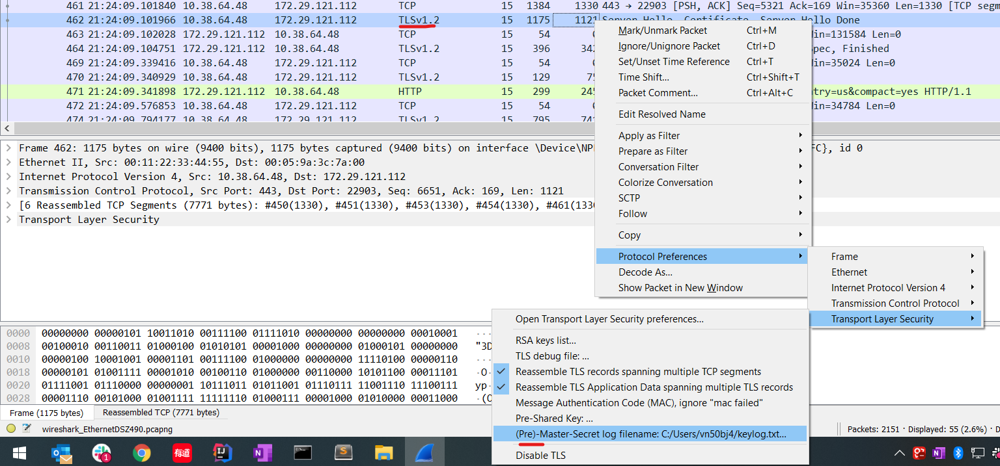

###use chrome dev tool to analyze node application
```
step 1:
start node application which following node parameters:
--expose-gc --inspect

step 2:
open chrome and visit chrome://inspect
click the on remote target item to view detail of application.
```
#### add symbol link to test local npm module
```
this command line will create a symbol link in module "another-module"'s node_modules folder
which reference "test-module"
mklink /D "C:\projects\another-module\node_modules\test-module" "C:\projects\test-module"

another way to create link:
step 1.
run 'npm link' in the repo you want to create a symbolic link in global node_mudles

step 2.

change working directory to the project root where you want to reference the previous created module
then execute 'npm link <modelue_name>', here the module name is the name inside the package.json of the modlue
you want to reference.

```
####setup maximum memory of node process
```
add --max-old-space-size node parameter to specify the maxium memory
the unit is MB, e.g:
--max-old-space-size=10 will setup a maxium 10BM memory limit.
```

###how to decrypt tls(https) traffic in nodejs
- let nodejs save ssl key to a keylog.txt file
```
start node application with following paramter
node --tls-cipher-list="AES128-SHA"  --tls-keylog=C:\Users\vn50bj4\keylog.txt test.js
```
- use the keylog in wireshark to decrypt the traffic
