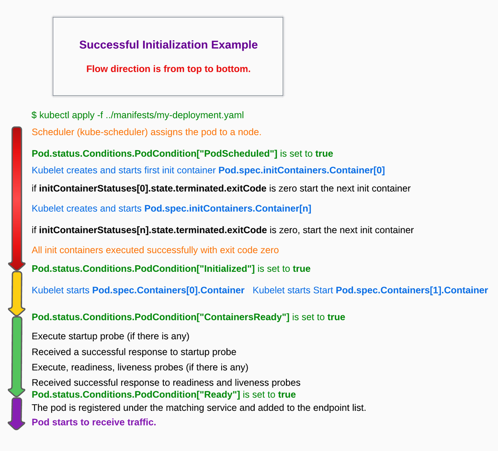

### create a deployment
```
kubectl create deployment {deployment_name} --image={docker_image_name}
```
### view all deployments
```
kubectl get deployments
```
### view all pods
```
kubectl get pods
```
### view all pods filtered by label
```
kubectl get pods -l app=v1
```
### view cluster events
```
kubectl get events
```
### view services
```
kubectl get services
```
### view kubectl configuration
```
kubectl config view
```
### create a service
```
kubectl expose deployment hello-node --type=LoadBalancer --port=8080
```
### get pods detail
```
kubectl describe pods
```
### get pod name and store into variable
```
export POD_NAME=$(kubectl get pods -o go-template --template '{{range .items}}{{.metadata.name}}{{"\n"}}{{end}}')
```
### get logs for container
```
kubectl logs $POD_NAME
```
### execute command in pod's container(can omit container name when pod contains only one container)
```
kubectl exec $POD_NAME env
```
### open a bash in pod container(can omit container name when pod contains only one container)
```
kubectl exec -ti $POD_NAME bash
```
### update pod's label
```
kubectl label pod $POD_NAME app=v1
```
### update deployment's image
```
kubectl set image deployments/{deployment_name} {container_name}={image_name}
```
### watch the rollout status of deployment
```
kubectl rollout status deployment/{deployment_name}
```
### rollback rollout
```
kubectl rollout undo deployments/{deployment_name}
```
## what's Service ?
A Service in Kubernetes is an abstraction which defines a logical set of Pods and a policy by which to access them.
Services enable a loose coupling between dependent Pods.
An API object that describes how to access applications, such as a set of Pods , and can describe ports and load-balancers.
The access point can be internal or external to the cluster.
## what's Pod ?
The smallest and simplest Kubernetes object. A Pod represents a set of running containers on your cluster.
A Pod is typically set up to run a single primary container. 
It can also run optional sidecar containers that add supplementary features like logging.
Pods are commonly managed by a Deployment.
## what's Deployment ?
 An API object that manages a replicated application.
 Each replica is represented by a Pod Lifecycle , and the Pods are distributed among the nodes of a cluster. 
 
## what's Node ?
A node is a worker machine in Kubernetes.
A worker machine may be a VM or physical machine, depending on the cluster.
It has the Services necessary to run Pods and is managed by the master components.
The Services on a node include Docker, kubelet and kube-proxy.

### pod initialization


### why we use init container
Separation of concerns
Security
