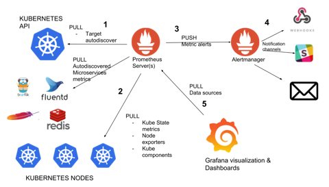

## Metric types:
- Counter
- Gauge
- Histogram
- Summary


## Arithmetic binary operator:

- \+ (addition)
- \- (subtraction)
- \* (multiplication)
- / (division)
- % (modulo)
- ^ (power/exponentiation)


## dbinary operator:
- == (equal)
- != (not-equal)
- \> (greater-than)
- < (less-than)
- \>= (greater-or-equal)
- <= (less-or-equal)

## Logical operator:
- and (intersection)
- or (union)
- unless (complement)


## Vector matching:
### One to one matching:
- <vector expr> <bin-op> ignoring(<label list>) <vector expr>
- <vector expr> <bin-op> on(<label list>) <vector expr>
### Many to one or one to many matching:
- <vector expr> <bin-op> ignoring(<label list>) group_left(<label list>) <vector expr>
- <vector expr> <bin-op> ignoring(<label list>) group_right(<label list>) <vector expr>
- <vector expr> <bin-op> on(<label list>) group_left(<label list>) <vector expr>
- <vector expr> <bin-op> on(<label list>) group_right(<label list>) <vector expr>

### Aggregation operation:
- sum (calculate sum over dimensions)
- min (select minimum over dimensions)
- max (select maximum over dimensions)
- avg (calculate the average over dimensions)
- stddev (calculate population standard deviation over dimensions)
- stdvar (calculate population standard variance over dimensions)
- count (count number of elements in the vector)
- count_values (count number of elements with the same value)
- bottomk (smallest k elements by sample value)
- topk (largest k elements by sample value)
- quantile (calculate φ-quantile (0 ≤ φ ≤ 1) over dimensions)

```shell
<aggr-op>([parameter,] <vector expression>) [without|by (<label list>)]
```


## Range vector unit:
- s - seconds
- m - minutes
- h - hours
- d - days
- w - weeks
- y - years

From <https://prometheus.io/docs/prometheus/latest/querying/basics/>

### Offset modifer:
http_requests_total offset 5m


